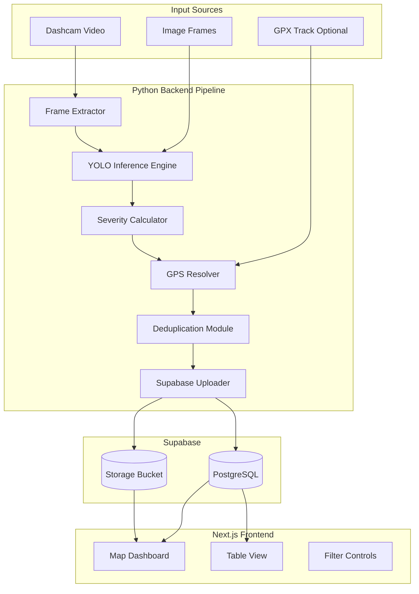
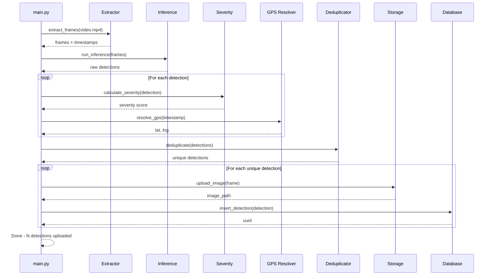
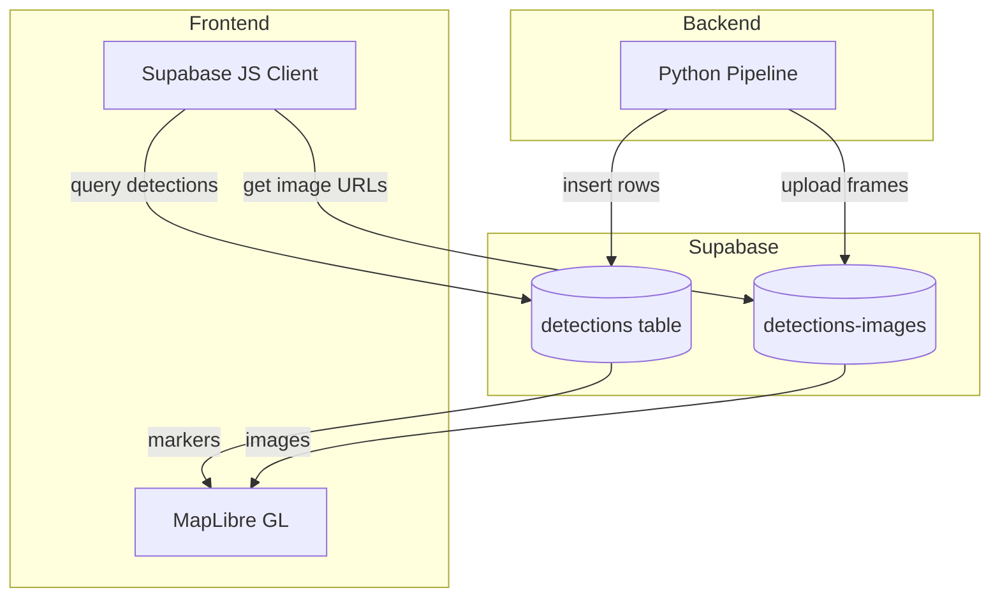

# RoadSense - Road Damage Intelligence

AI-powered road damage detection system using dashcam video analysis. Detects potholes, cracks, ruts, and debris, then visualizes them on an interactive map dashboard for engineers.

## Repo Structure

- `frontend/` - Next.js 16 TypeScript dashboard (map + list + filters)
- `backend/` - Python inference + ingestion scripts

## System Architecture



## Data Flow



## Integration Architecture



## Backend Directory Structure

```
/backend
├── main.py                 # CLI entry point
├── requirements.txt        # Python dependencies
├── config.py               # Configuration
├── pipeline/
│   ├── extractor.py        # Video frame extraction
│   ├── inference.py        # YOLO model inference
│   ├── severity.py         # Severity scoring
│   ├── gps.py              # GPS resolution
│   └── dedup.py            # Deduplication
├── db/
│   ├── client.py           # Supabase client
│   ├── storage.py          # Image upload
│   └── database.py         # Detection insertion
├── utils/
│   ├── bbox.py             # Bounding box utilities
│   └── logger.py           # Logging setup
├── routes/
│   └── ottawa_eagleson_1km.gpx  # Demo GPX route
├── scripts/
│   └── setup_supabase.sql  # Database schema setup
├── tests/
│   └── test_pipeline.py    # Unit tests
└── models/
    └── weights/            # YOLO model weights
```

## Detection Data Contract

Backend guarantees each detection includes:

| Field | Type | Description |
|-------|------|-------------|
| `id` | UUID | Generated by Supabase |
| `created_at` | Timestamp | Row creation time |
| `captured_at` | Timestamp | Frame capture time |
| `lat` | Float | Latitude |
| `lng` | Float | Longitude |
| `damage_type` | String | pothole, crack, rut, debris |
| `confidence` | Float | 0.0 - 1.0 |
| `severity` | Float | 0.0 - 1.0 |
| `bbox` | JSON | {x1, y1, x2, y2} |
| `image_path` | String | Storage path |
| `source_id` | String | Processing run ID |
| `status` | String | new, reviewed, repaired |

## Supabase Schema

### Table: `detections`

```sql
CREATE TABLE detections (
    id UUID PRIMARY KEY DEFAULT gen_random_uuid(),
    created_at TIMESTAMPTZ DEFAULT now(),
    captured_at TIMESTAMPTZ NOT NULL,
    lat FLOAT8 NOT NULL,
    lng FLOAT8 NOT NULL,
    damage_type TEXT NOT NULL CHECK (damage_type IN ('pothole', 'crack', 'rut', 'debris')),
    confidence FLOAT4 NOT NULL CHECK (confidence >= 0 AND confidence <= 1),
    severity FLOAT4 NOT NULL CHECK (severity >= 0 AND severity <= 1),
    bbox JSONB NOT NULL,
    image_path TEXT NOT NULL,
    source_id TEXT NOT NULL,
    status TEXT DEFAULT 'new' CHECK (status IN ('new', 'reviewed', 'repaired'))
);

CREATE INDEX idx_detections_source ON detections(source_id);
CREATE INDEX idx_detections_type ON detections(damage_type);
CREATE INDEX idx_detections_severity ON detections(severity);
CREATE INDEX idx_detections_location ON detections(lat, lng);
CREATE INDEX idx_detections_created ON detections(created_at DESC);
CREATE INDEX idx_detections_status ON detections(status);
```

### Table: `sources` (optional)

```sql
CREATE TABLE sources (
    id TEXT PRIMARY KEY,
    name TEXT,
    description TEXT,
    video_path TEXT,
    frame_count INTEGER,
    detection_count INTEGER,
    created_at TIMESTAMPTZ DEFAULT now(),
    completed_at TIMESTAMPTZ
);
```

### Storage Bucket

- Bucket name: `detections-images`
- Public access for demo

## Severity Calculation

```
severity = (area_ratio * 0.4) + (type_weight * 0.4) + (confidence * 0.2)
```

| Damage Type | Weight |
|-------------|--------|
| pothole | 1.0 |
| crack | 0.6 |
| rut | 0.8 |
| debris | 0.5 |

## Frontend Setup

```bash
cd frontend
npm install
npm run dev
```

Open http://localhost:3000

### Supabase Environment

Set these env vars in `frontend/.env.local`:

```
NEXT_PUBLIC_SUPABASE_URL=...
NEXT_PUBLIC_SUPABASE_ANON_KEY=...
```

## Backend Setup

```bash
cd backend
pip install -r requirements.txt
```

Create `.env` file (see `.env.example`):

```
# Supabase Configuration
SUPABASE_URL=https://your-project.supabase.co
SUPABASE_SERVICE_KEY=your-service-role-key

# YOLO Model Configuration
# Option 1: HuggingFace model (default)
YOLO_MODEL_PATH=cazzz307/Pothole-Finetuned-YoloV8
# Option 2: Local model file
# YOLO_MODEL_PATH=./models/weights/best.pt

# Detection Settings
DEFAULT_CONFIDENCE_THRESHOLD=0.25
DEFAULT_FPS=1

# HuggingFace Authentication (required for gated models)
HF_TOKEN=your-huggingface-token
```

## Backend CLI Usage

```bash
# Process video file
python main.py process --input video.mp4 --source-id demo_run_1

# Process folder of frames
python main.py process --input ./frames/ --source-id demo_run_1

# With GPX file for GPS data
python main.py process --input video.mp4 --gpx route.gpx --source-id demo_run_1

# Dry run (output JSON, no upload)
python main.py process --input video.mp4 --dry-run --output detections.json
```

### CLI Options

| Option | Description | Default |
|--------|-------------|---------|
| `--input` | Video file or frames directory | Required |
| `--source-id` | Identifier for this run | Required |
| `--gpx` | GPX file for GPS matching | None |
| `--fps` | Frame extraction rate | 1 |
| `--conf-threshold` | Minimum confidence | 0.25 |
| `--dry-run` | Output JSON without upload | False |
| `--output` | Output file for dry run | None |
| `--no-dedup` | Skip deduplication | False |
| `--route` | Demo route: ottawa, sf, or custom | ottawa |

### Additional CLI Commands

```bash
# Test Supabase connection
python main.py test-connection

# Get detection statistics for a source
python main.py stats --source-id demo_run_1
```

## Dependencies

### Frontend

- Next.js 16+
- React 18+
- @supabase/supabase-js
- maplibre-gl

### Backend

```
ultralytics>=8.0.0      # YOLOv8
opencv-python>=4.8.0    # Video/image processing
supabase>=2.0.0         # Supabase Python client
python-dotenv>=1.0.0    # Environment variables
gpxpy>=1.6.0            # GPX parsing
click>=8.0.0            # CLI framework
numpy>=1.24.0           # Numerical operations
haversine>=2.8.0        # GPS distance calculations
pillow>=10.0.0          # Image processing
pillow-heif>=0.13.0     # HEIF image support
piexif>=1.1.3           # EXIF metadata parsing
supervision>=0.16.0     # Detection utilities
huggingface_hub>=0.20.0 # Model downloading
```

## Team Responsibilities

| Member | Role | Deliverables |
|--------|------|--------------|
| A | Frontend Lead | Map + UI, markers, filters |
| B | Supabase + Frontend | Data layer, table views, seed scripts |
| C | Backend/AI Lead | YOLO inference, severity scoring |
| D | Backend/Systems | Supabase ingestion, GPS handling |
